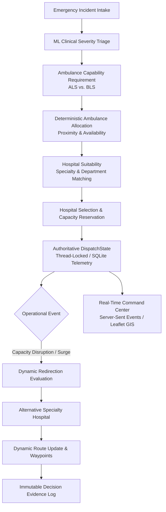

# RAAH
**Real-time Ambulance Allocation & Hospital Redirection**

[](https://github.com/mohiitrathor/RAAH/actions/workflows/ci.yml)

[](LICENSE)

RAAH is an ML-assisted emergency dispatch and hospital coordination platform built around deterministic operational logic, live simulation state, and dynamic hospital redirection.

> [!IMPORTANT]
> **RESEARCH & DEMONSTRATION EMS PLATFORM DISCLAIMER**
> RAAH is an operational research platform, decision-support prototype, and simulation environment — **it is not a certified medical device** or clinical diagnostic instrument.
> - Machine learning models provide risk and priority classification solely for tactical prioritization and resource routing.
> - Fleet dispatch, capability matching, and hospital balancing algorithms are deterministic and advisory.
> - Dynamic redirection evaluates facility capacities and travel constraints to assist dispatchers.
> - Human dispatchers, medical directors, and licensed healthcare professionals retain authoritative control over all clinical care and dispatch decisions at all times.

---

## Overview

Emergency Medical Services (EMS) face compounding challenges during mass-casualty events, peak hours, and local hospital saturation surges. In traditional CAD (Computer-Aided Dispatch) workflows, ambulance destination decisions are often static once assigned. If a receiving emergency department reaches saturation while an ambulance is en route, patient offload delays (bed blocking) can escalate rapidly.

RAAH combines:
1. **Calibrated Machine Learning Triage**: Classifies patient clinical severity from emergency intake vitals into actionable priority tiers.
2. **Deterministic Capability Allocation**: Matches incident requirements to vehicle capabilities (Advanced Life Support vs. Basic Life Support) and evaluates road network proximity.
3. **Capacity-Aware Hospital Balancing**: Monitors real-time bed and ICU availability across regional receiving facilities to prevent department overcrowding.
4. **Dynamic Mid-Transit Redirection**: Automatically detects facility saturation disruptions while transport is underway, evaluates alternative facilities, recalculates routes, and logs auditable decision evidence — locked once the vehicle arrives.
5. **Real-Time Tactical Command Center**: Delivers live situational awareness via Server-Sent Events (SSE) and interactive GIS mapping.

---

## Why RAAH?

* **Explainable & Deterministic**: Core resource allocations and facility choices follow clear, rule-based algorithms rather than opaque black-box optimization.
* **Audit-Grade Decision Evidence**: Every triage classification, vehicle assignment, and mid-transit divert generates an immutable, structured audit log.
* **Dynamic Surge Resilience**: En-route transports adapt to real-time hospital closures or sudden casualty surges before ambulances arrive at saturated facilities.
* **Zero-Build Web Interface**: Modern, self-contained Command Center frontend using vanilla ES6 JavaScript and vendored Leaflet/Lucide assets without complex Node.js build pipelines.
* **Durability & Crash Recovery**: Authoritative, thread-locked state engine backed by SQLite event logging and periodic checkpoint snapshots.

---

## Key Capabilities

* **End-to-End Incident Intake & ML Triage**: Accepts 24 clinical parameters (vitals, GCS, condition indicators) and predicts priority (`P1` to `P4`).
* **Deterministic Fleet Matching**: Dispatches ALS units for high-acuity incidents (`P1`/`P2`) and BLS units for lower-acuity calls (`P3`/`P4`).
* **Hospital Bed & ICU Balancing**: Maintains in-flight reservation counts to balance emergency department load across the health network.
* **Dynamic En-Route Redirection**: Event-driven re-routing of transporting ambulances upon receiving hospital capacity saturation (`HOSPITAL_FULL`), protected by arrival-locking safeguards.
* **Replay & Post-Incident Review (PIR)**: Replays historical incident runs at variable speeds ($1\times$ to $10\times$) with side-by-side run comparison.
* **Mass-Casualty Incident (MCI) Protocol**: Secondary triage queues and mutual-aid agency coordination across regional zones.
* **External Telemetry Adapters**: Authenticated ingestion endpoints for external CAD, GPS/AVL vehicle pings, hospital capacity feeds, and traffic data.

---

## System Architecture



### Component Architecture

```
External CAD / Telemetry              Live Dispatch Intake (UI)
           │                                      │
           ▼                                      ▼
┌─────────────────────────────────────────────────────────────┐
│                 Ingestion & Adapters Layer                  │
│  - M2M API Key & Scoped Provider Authorization              │
│  - CAD Triage Mapper (Zero Fabricated Physiology)           │
└──────────────────────────────┬──────────────────────────────┘
                               │ Normalized Clinical Vector (24 Features)
                               ▼
┌─────────────────────────────────────────────────────────────┐
│                 Clinical ML Inference Layer                 │
│  - Frozen Scikit-Learn Pipeline (Trained Logistic Regr.)    │
│  - Outputs Severity (Critical..Non-Urgent) & Priority (P1..P4)
└──────────────────────────────┬──────────────────────────────┘
                               │ Predicted Severity & Priority
                               ▼
┌─────────────────────────────────────────────────────────────┐
│             Deterministic Dispatch & Routing Engine         │
│  - Rule-Based Capability Matching (ALS vs. BLS)             │
│  - Proximity Scoring & Travel Time Estimation               │
│  - Receiving Hospital Department & Capacity Matching        │
│  - En-Route Redirection Engine (Capacity Surge Divert)      │
└──────────────────────────────┬──────────────────────────────┘
                               │ State Mutation & Decision Evidence
                               ▼
┌─────────────────────────────────────────────────────────────┐
│           Authoritative DispatchState & Persistence         │
│  - Single Source of Truth under Thread Lock                 │
│  - SQLite Event Telemetry & Periodic State Checkpoints      │
│  - Read-Only Replay Analysis Engine (PRAGMA query_only=ON)  │
└──────────────────────────────┬──────────────────────────────┘
                               │ Event Broadcast
                               ▼
┌─────────────────────────────────────────────────────────────┐
│               Real-Time Command Center (SSE)                │
│  - Server-Sent Events (/events/stream)                      │
│  - Tactical Leaflet GIS Map, Hospital Occupancy Meters      │
│  - One-Click Surge Demo & 9-Step Interactive Timeline       │
│  - Decision Evidence Modal & PIR Run Comparison             │
└─────────────────────────────────────────────────────────────┘
```

---

## How Dispatch Works

1. **Intake & Vector Normalization**: Emergency caller observations and patient vitals are mapped into a standardized 24-feature clinical vector.
2. **Clinical Severity Inference**: The scikit-learn pipeline predicts clinical severity category and maps it to priority level `P1` (Critical), `P2` (Emergency), `P3` (Urgent), or `P4` (Non-Urgent).
3. **Vehicle Allocation**:
   - `P1` and `P2` calls require **Advanced Life Support (ALS)** units equipped for critical interventions.
   - `P3` and `P4` calls are serviced by **Basic Life Support (BLS)** units.
   - Candidate vehicles are scored by road network proximity, status (`AVAILABLE`), and station zone.
4. **Hospital Selection**:
   - Matches clinical specialty needs (Trauma Center, Cardiac Catheterization Lab, Stroke Unit, ICU).
   - Verifies bed availability and reserves capacity in real time to prevent overloading single facilities.
5. **State Broadcast**: The authoritative `DispatchState` updates vehicle status to `EN_ROUTE_TO_SCENE`, persists state to SQLite, and broadcasts updates via SSE to all connected dashboards.

---

## ML Triage

The clinical triage component utilizes a trained **Logistic Regression** pipeline evaluated against multi-class emergency incident data.

### Offline Model Evaluation (Training & Validation)

The clinical severity prediction model was trained and evaluated on 100,000 emergency patient incidents (80,000 train / 20,000 test stratified split) across 24 input features:

| Parameter | Specification |
| :--- | :--- |
| **Model Type** | Multi-class Logistic Regression with L2 regularization |
| **Pipeline Architecture** | `ColumnTransformer` (StandardScaler for numerics, OneHotEncoder for categoricals) |
| **Input Features** | 24 clinical features (18 numerical vitals/scores, 6 categorical condition indicators) |
| **Target Classes** | 5 levels: `Non-Urgent`, `Low`, `Moderate`, `Emergency`, `Critical` |
| **Overall Accuracy** | **68.95%** |
| **Balanced Accuracy** | **67.07%** |
| **Model Artifact** | Frozen joblib pipeline (`Models/Final Model/logistic_regression_final.joblib`) |
| **Framework Version** | Exactly pinned to `scikit-learn==1.7.2` |

> [!NOTE]
> Balanced accuracy was prioritized during model evaluation to ensure sensitive identification of rare, high-acuity `Critical` cases within imbalanced emergency incident distributions. This offline evaluation measures predictive classification and is completely separate from runtime dispatch latency benchmarks.

---

## Dynamic Hospital Redirection

When an ambulance is transporting a patient (`EN_ROUTE_TO_HOSPITAL`), conditions at the receiving facility may deteriorate due to sudden casualty surges or equipment failure:

1. **Disruption Trigger**: The hospital status updates to `HOSPITAL_FULL` or `DIVERT`.
2. **Candidate Re-Evaluation**: The redirection engine evaluates alternative qualified hospitals within an acceptable detour radius.
3. **Divert Decision**: If a suitable facility with available capacity exists, the transport destination is updated, the bed reservation is transferred, and new routing waypoints are calculated.
4. **Decision Evidence**: An auditable evidence record is committed to SQLite documenting why the diversion occurred, alternative facilities considered, and ETA differentials.
5. **Arrival-Lock Safeguard**: Once the ambulance status transitions to `ARRIVED`, dynamic redirection is permanently locked. Any subsequent divert attempts return HTTP 404 / operation rejected.

---

## Tactical Command Center

The Tactical Command Center provides dispatchers and incident commanders with a unified real-time dashboard:

* **Interactive GIS Map**: Dark-mode Leaflet map showing live ambulance positions, stations, incidents, and receiving hospitals.
* **Live Fleet Status**: Grid showing vehicle availability, crew capability (ALS vs. BLS), current speed, and active mission phase.
* **Hospital Capacity Meters**: Real-time occupancy gauges tracking regular bed and ICU utilization.
* **Incident Intake Drawer**: Manual dispatch intake form for walk-in or phone calls with instant ML triage calculation.
* **Decision Evidence Modal**: Comprehensive forensic breakdown of every automated dispatch and divert decision.
* **Post-Incident Review**: Historical run selector with replay controls ($1\times$, $2\times$, $5\times$, $10\times$) and timeline scrubber.

---

## Demo

RAAH includes a complete, self-contained demonstration flow that walks through the entire emergency response cycle:

```text
01 Incident Received ──> 02 ML Triage (Critical P1) ──> 03 Ambulance Assigned (ALS)
      │
      ▼
04 Hospital Selected (Cardiac ICU) ──> 05 Capacity Disruption (HOSPITAL_FULL)
      │
      ▼
06 Redirection Evaluated ──> 07 Alternative Hospital Selected ──> 08 Route Updated
      │
      ▼
09 Decision Recorded in Audit Log ──> 10 Arrival & Reroute Lock Enforced
```

### Running the Headless Demo

Execute the automated demonstration script directly from your terminal:

```bash
./run.sh demo
```

The script boots a temporary backend instance, injects a critical cardiac incident, simulates hospital capacity saturation, verifies the automated dynamic divert, validates the decision evidence log, and confirms the arrival-lock safeguard.

### Running the Demo via Web UI

1. Start the platform: `./run.sh`
2. Open `http://localhost:8000` in your browser.
3. Click the **`[⚡ SIMULATE SURGE & DIVERT]`** button in the top navigation bar.
4. Watch the interactive 9-step timeline overlay track each milestone in real time on the GIS map.

---

## Demo Preview

The repository includes a fully functional, zero-build web interface:

```bash
./run.sh start
```

Then open your browser to:

```text
http://localhost:8000
```

From the Command Center, you can monitor live vehicle movement, trigger disaster drills, inspect decision evidence, and run post-incident replays.

---

## Performance

The dispatch and redirection engine is continuously benchmarked for high-throughput, low-latency execution:

```bash
./run.sh benchmark
```

### Verified Benchmark Scorecard

| Metric | Verified Result | Target Threshold | Status |
| :--- | ---: | :--- | :---: |
| **Mean Dispatch Latency** | **~8.30 ms** | $< 50.0\text{ ms}$ | PASS |
| **Median Dispatch Latency** | **~8.27 ms** | $< 20.0\text{ ms}$ | PASS |
| **Dynamic Redirect Latency** | **~1.66 ms** | $< 20.0\text{ ms}$ | PASS |
| **Ambulance Allocation Rate** | **100.0%** | $100.0\%$ | PASS |
| **Hospital Allocation Rate** | **100.0%** | $100.0\%$ | PASS |
| **Capability Match Rate** | **100.0%** | $> 95.0\%$ | PASS |
| **Dispatch Engine Errors** | **0** | $0$ | ZERO ERRORS |
| **Regression Test Suite** | **418 passed** | $418\text{ passed}$ | PASS |

> [!NOTE]
> Benchmark results are measured within the RAAH discrete-time simulation environment on local hardware; these figures reflect software algorithm throughput and do not represent real-world EMS vehicle arrival or road transit guarantees.

---

## Quick Start

### Prerequisites

* Python 3.10 – 3.13 (Python 3.12 recommended)
* Modern web browser (Chrome, Firefox, Safari, Edge)

### Installation & Launch

```bash
# 1. Clone the repository
git clone https://github.com/mohiitrathor/RAAH.git
cd RAAH

# 2. Run the unified launcher
./run.sh
```

The launcher automatically detects available virtual environments or Conda (`ai_env`), verifies dependencies, initializes storage directories, and starts the FastAPI server on `http://localhost:8000`.

---

## CLI Commands

The unified [`run.sh`](run.sh) script provides access to all platform workflows:

| Command | Description |
| :--- | :--- |
| `./run.sh` | Launches FastAPI backend & Command Center on `http://localhost:8000` |
| `./run.sh start` | Same as `./run.sh` (explicit start command) |
| `./run.sh demo` | Executes the automated end-to-end live surge & divert demonstration |
| `./run.sh benchmark` | Runs dispatch latency percentiles and allocation quality audits |
| `./run.sh test` | Runs the full regression test suite (`pytest -q`) |
| `./run.sh desktop` | Launches the native Linux GTK3/WebKit2 desktop application |
| `./run.sh docker` | Displays Docker build and execution instructions |
| `./run.sh --help` | Displays command line usage and environment options |

---

## API

Interactive OpenAPI Swagger UI documentation is available at `http://localhost:8000/docs`.

### Primary Endpoints

| Endpoint | Method | Purpose |
| :--- | :---: | :--- |
| `/` | `GET` | Tactical Operations Command Center (redirects to `/dashboard/`) |
| `/health` | `GET` | Process liveness probe |
| `/health/ready` | `GET` | Deep readiness probe (database, simulator, ML, adapters) |
| `/events/stream` | `GET` | Real-time Server-Sent Events (SSE) telemetry feed |
| `/state/snapshot` | `GET` | Current authoritative simulation state snapshot |
| `/dispatch/incident` | `POST` | Ingest incident and calculate optimal ambulance & hospital |
| `/dispatch/redirection` | `POST` | Evaluate dynamic hospital redirection for en-route transport |
| `/decision-evidence/incident/{id}` | `GET` | Retrieve auditable decision evidence records |
| `/replays/runs` | `GET` | List recorded simulation runs available for PIR replay |

---

## Authentication & Security

RAAH enforces strict security and environment safeguards:

* **Role-Based Access Control (RBAC)**: REST endpoints support JWT Bearer token authentication and Machine-to-Machine (M2M) API keys with granular scopes (`cad:write`, `gps:write`, `hospital:write`).
* **Production Invariants**:
  * `RAAH_DEV_AUTH_FALLBACK` is strictly disabled (`false`) in production.
  * `RAAH_JWT_SECRET_KEY` must be configured with a cryptographically strong secret ($\ge 32$ bytes). Default development signing keys are rejected on startup.
  * CORS origins must be explicitly enumerated in production; wildcard origin (`*`) with credentials enabled is prohibited.
* **Immutable Clinical Model**: The trained logistic regression pipeline is frozen and read-only.
* **Auditable Telemetry**: Every state transition and dispatch decision records an immutable audit log entry.

### Configuration Reference (`.env.example`)

| Variable | Default | Description |
| :--- | :--- | :--- |
| `RAAH_APP_NAME` | `"RAAH — Emergency Dispatch & Coordination Platform"` | Platform application title |
| `RAAH_ENVIRONMENT` | `development` | Deployment environment (`development`, `staging`, `production`) |
| `RAAH_HOST` | `0.0.0.0` | Bind host address |
| `RAAH_PORT` | `8000` | Bind port |
| `RAAH_AUTH_ENFORCED` | `true` | Enforces authentication on protected API routes |
| `RAAH_DEV_AUTH_FALLBACK` | `false` (in prod) | Development token fallback (must be `false` in production) |
| `RAAH_JWT_SECRET_KEY` | *(Secret string)* | Cryptographic signing key ($\ge 32$ bytes in production) |
| `RAAH_CORS_ORIGINS` | `http://localhost:8000` | Allowed CORS origins (comma-separated, no wildcards in prod) |
| `RAAH_DATABASE_PATH` | `data/raah_history.db` | Persistent SQLite database file path |
| `RAAH_CHECKPOINT_INTERVAL_SECONDS` | `30.0` | Periodic state snapshot interval |

---

## Docker

Containerization manifests are provided for container-based deployments:

```bash
# 1. Build the production Docker image
docker build -t raah:latest .

# 2. Run container
docker run -d \
  --name raah \
  -p 8000:8000 \
  -v $(pwd)/data:/app/data \
  --env-file .env \
  raah:latest

# Or launch with Docker Compose
docker compose up -d
```

> [!NOTE]
> The multi-stage `Dockerfile` and `docker-compose.yml` configurations have been statically validated against the project configuration contract. Running these commands requires a host with an active Docker or Podman daemon.

---

## Desktop Application

For dedicated dispatch workstation deployment, RAAH includes a native Linux desktop application built with GTK 3 and WebKit2:

```bash
./run.sh desktop
```

* Embeds the Tactical Command Center in a dedicated hardware-accelerated desktop window.
* Includes an integrated background supervisor that manages the FastAPI backend lifecycle automatically.
* Verified with a dedicated unit test suite (`test_desktop_wrapper.py`: 7/7 tests passing).

---

## Project Structure

```text
RAAH/
├── .github/                         # GitHub Actions CI Workflows
│   └── workflows/ci.yml             # Automated testing, demo, and syntax validation
├── api/                             # FastAPI Backend & Integration Layer
│   ├── adapters/                    # External provider adapters & M2M auth (CAD, GPS, Hospital, Traffic)
│   ├── auth/                        # JWT cryptographic token security & RBAC permissions
│   ├── decision_evidence/           # Observational decision evidence capture & store
│   ├── observability/               # Metrics collection, structured JSON logging, middleware
│   ├── persistence/                 # SQLite database connection, bridge queue, schema migrations
│   ├── realtime/                    # Server-Sent Events (SSE) broadcaster & event models
│   ├── routers/                     # REST API routers (dispatch, ingestion, replays, drills, etc.)
│   ├── schemas/                     # Pydantic request and response schemas
│   ├── dependencies.py              # SimulatorManager runtime dependency & lifecycle supervisor
│   ├── main.py                      # FastAPI application definition, lifespan, & static mounts
│   └── settings.py                  # Pydantic Settings configuration layer (env prefix RAAH_)
├── Dataset/                         # Authoritative Baseline Data
│   ├── ambulances.csv               # Baseline fleet roster with vehicle types (ALS/BLS) & coordinates
│   ├── hospitals.csv                # Receiving hospitals, departments, and initial bed/ICU capacities
│   └── patient_incidents.csv        # Baseline historical emergency call data (100k incidents)
├── Dispatch/                        # Deterministic Dispatch & Simulation Core
│   ├── coordination/                # Multi-agency coordination, zones, and mutual aid
│   ├── optimization/                # Fleet repositioning and hospital diversion advisories
│   ├── routing/                     # Kinematics travel time estimation and road network routing
│   ├── scenarios/                   # Disaster drill generators, replay engine, PIR, and regression
│   ├── dispatch_engine.py           # Core deterministic ambulance & hospital selection algorithms
│   ├── redirection_engine.py        # Live hospital saturation detection & patient redirection
│   ├── simulator.py                 # Discrete-time simulation engine & event pipeline
│   └── state.py                     # Authoritative DispatchState representation
├── frontend/                        # Web Tactical Command Center (Zero-Build Vanilla JS/CSS)
│   ├── css/                         # Tactical dark-mode stylesheets & typography
│   ├── js/                          # Application controllers, Leaflet map engine, API client
│   │   └── components/              # Modals (intake, evidence), replay controls, PIR, drills, demo
│   ├── vendor/                      # Local vendor assets (Leaflet, Lucide icons)
│   └── index.html                   # Command Center single-page application layout
├── Models/                          # Clinical Machine Learning Artifacts & Reports
│   ├── Final Model/                 # Frozen clinical model, scaler, feature vector, & inference script
│   ├── Analysis/                    # Model confidence, error, and calibration analysis scripts
│   ├── Model Tuning/                # Hyperparameter tuning records (Logistic Regression, XGBoost)
│   └── Reports/                     # Evaluation metrics, calibration curves, and comparison reports
├── scripts/                         # CLI Automation & Benchmark Scripts
│   ├── benchmark_suite.py           # Unified performance and dispatch evaluation benchmark
│   └── demo_runner.py               # Headless automated end-to-end demo execution
├── bin/                             # Desktop launcher script
│   └── raah-desktop                 # Portable Linux GTK/WebKit launcher
├── desktop/                         # Desktop application and supervisor
│   ├── app.py                       # Native GTK3/WebKit2 application wrapper
│   ├── supervisor.py                # Backend process supervisor
│   └── raah.desktop                 # Freedesktop application entry
├── data/                            # Local persistent storage directory (SQLite DB, checkpoints)
├── requirements.txt                 # Unified Python package dependencies
├── run.sh                           # Unified root entrypoint script
├── Dockerfile                       # Multi-stage production container image
├── docker-compose.yml               # Containerized stack definition
├── LICENSE                          # MIT License (Mohit Rathore)
├── .gitattributes                   # Cross-platform LF line ending enforcement
├── .gitignore                       # Repository exclusion rules
├── .env.example                     # Environment configuration template
└── README.md                        # Project documentation and operational guide
```

---

## Testing

Execute the comprehensive automated test suite:

```bash
./run.sh test
```

All **418 test cases** pass with zero errors and zero failures across:
* Clinical ML triage feature transformations and analytical fast-path equivalence
* Deterministic ALS/BLS capability matching and spatial proximity calculations
* Hospital bed reservation tracking and department suitability scoring
* Dynamic en-route redirection triggers and arrival-locking invariants
* Multi-agency mutual aid and mass casualty incident coordination
* Ingestion adapters, M2M authentication, and idempotency caching
* SQLite persistence, periodic checkpoints, and crash recovery
* Native Linux desktop wrapper and process supervisor

---

## Limitations

1. **Discrete Simulation Environment**: Kinematic vehicle velocities and transit durations reflect mathematical models in discrete simulation time rather than live hardware telemetry.
2. **Synthetic Demonstration Data**: The bundled incident, fleet, and hospital datasets represent realistic synthetic data designed for research, simulation drills, and evaluation.
3. **External Routing Providers**: When external routing credentials (e.g., OSRM, Google Maps Platform) are not configured, the system falls back to spherical Haversine distances with zone velocity heuristics.
4. **Regulatory Non-Certification**: RAAH is an operational research and tactical coordination software prototype. It is not certified under FDA, CE, or regional medical device regulations for automated diagnosis or autonomous dispatch.
5. **Host Environment Notice**: Docker daemon was not installed on the build host during this release cycle; container specifications have been statically verified and are ready for deployment on container-enabled environments.

---

## Roadmap

* [ ] Live OSRM / OpenStreetMap routing tile integration
* [ ] Multi-region federation for cross-state mutual aid dispatch
* [ ] Webhook adapters for live FHIR emergency department capacity feeds
* [ ] Mobile-optimized responsive layout for field supervisor tablets
* [ ] Automated scenario generator for regional disaster readiness drills

---

## License

This project is licensed under the MIT License — see the [LICENSE](LICENSE) file for details.

Copyright © 2026 Mohit Rathore.
